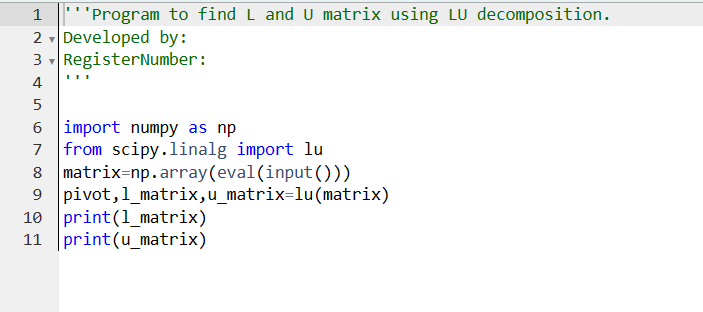
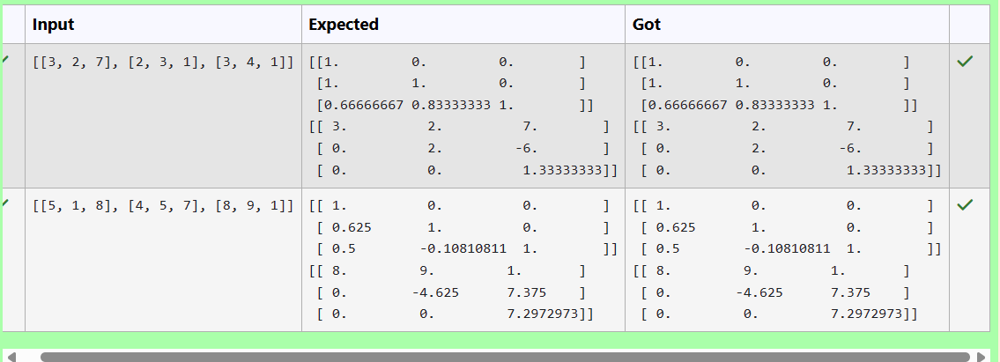
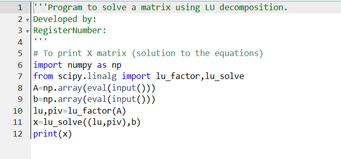
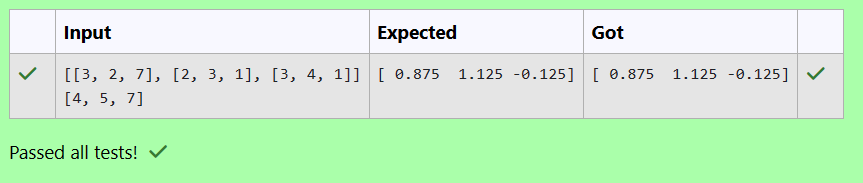

# LU Decomposition 

## AIM:
To write a program to find the LU Decomposition of a matrix.

## Equipments Required:
1. Hardware – PCs
2. Anaconda – Python 3.7 Installation / Moodle-Code Runner

## Algorithm
1. Import the numpy module to use the built-in functions for calculations
2. Import lu from scipy.linalg
3. Get the matrix from the user using np.array()
4. Use lu() to find the solution of L and U matrix
5. Use lu_factor() and lu_solve() to find the LU decomposition 
6. End the program

## Program:
(i) To find the L and U matrix

Program to find the L and U matrix.
Developed by: RAMYA R
RegisterNumber: 212223230169

```
import numpy as np
from scipy.linalg import lu
matrix=np.array(eval(input()))
pivot,l_matrix,u_matrix=lu(matrix)
print(l_matrix)
print(u_matrix)
```

(ii) To find the LU Decomposition of a matrix

Program to find the LU Decomposition of a matrix.
Developed by: RAMYA R
RegisterNumber: 212223230169

```
import numpy as np
from scipy.linalg import lu_factor,lu_solve
A=np.array(eval(input()))
b=np.array(eval(input()))
lu,piv=lu_factor(A)
x=lu_solve((lu,piv),b)
print(x)
```

## Output:


i)




ii)





## Result:
Thus the program to find the LU Decomposition of a matrix is written and verified using python programming.

